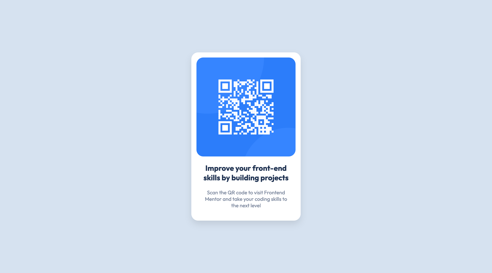
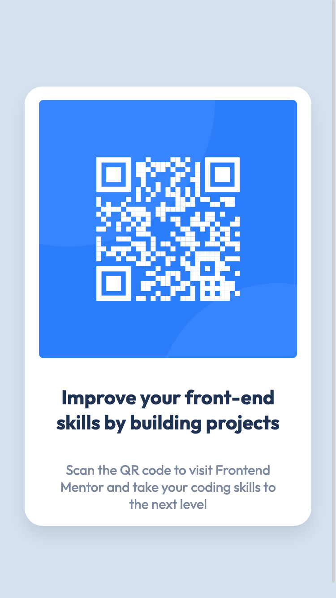

# Frontend Mentor - QR code component

## Table of contents

- [Overview](#overview)
  - [The challenge](#the-challenge)
  - [Screenshot](#screenshot)
  - [Links](#links)
- [My process](#my-process)
  - [Built with](#built-with)
- [Author](#author)

## Overview

### The challenge

Your challenge is to build out this QR code component and get it looking as close to the design as possible.

### Screenshot

### Links

- Solution URL: [Frontend Mentor](https://www.frontendmentor.io/solutions/)
- Live Site URL: [GitHub Pages](https://zmoerema.github.io/)

## My process

### Built with

- Semantic HTML5 markup
- CSS custom properties
- Mobile-first workflow

## Author

- Frontend Mentor - [@zmoerema](https://www.frontendmentor.io/profile/zmoerema)
